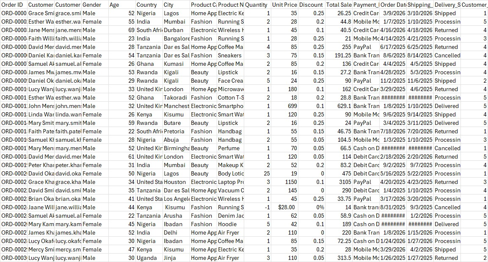
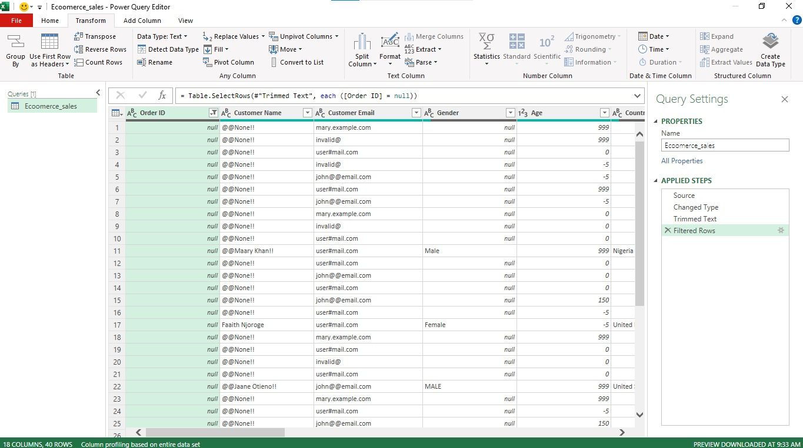
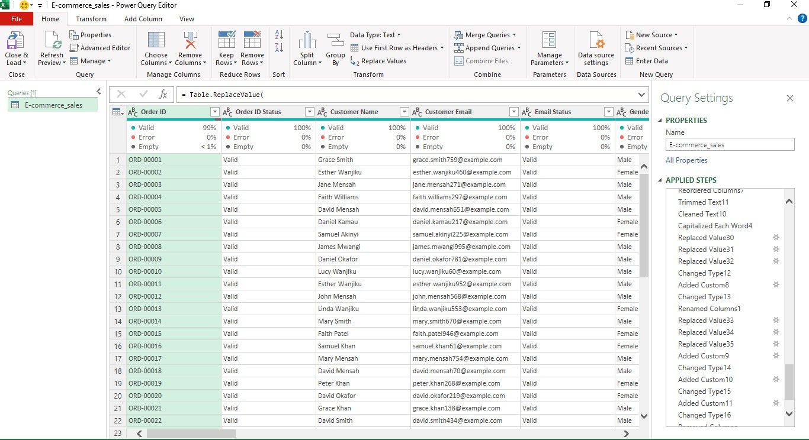
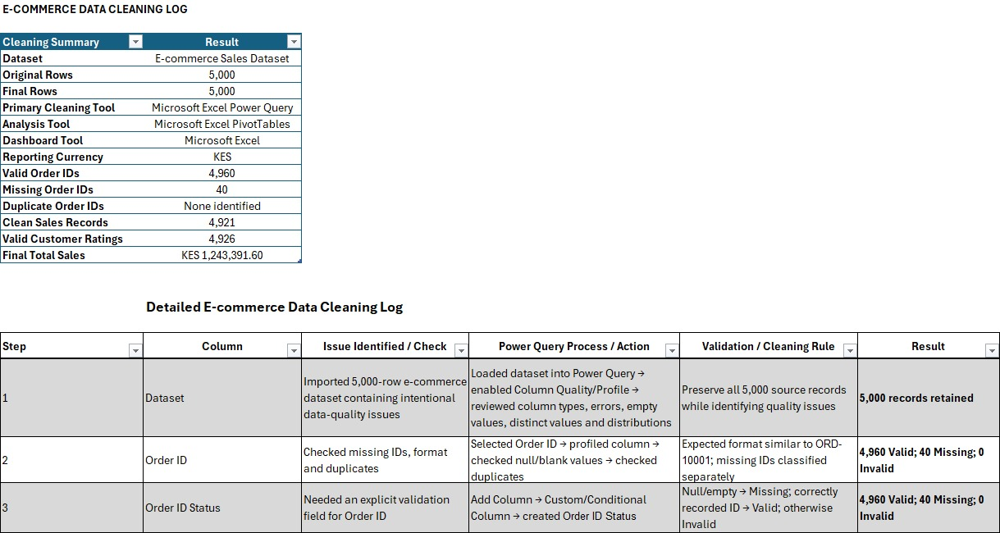
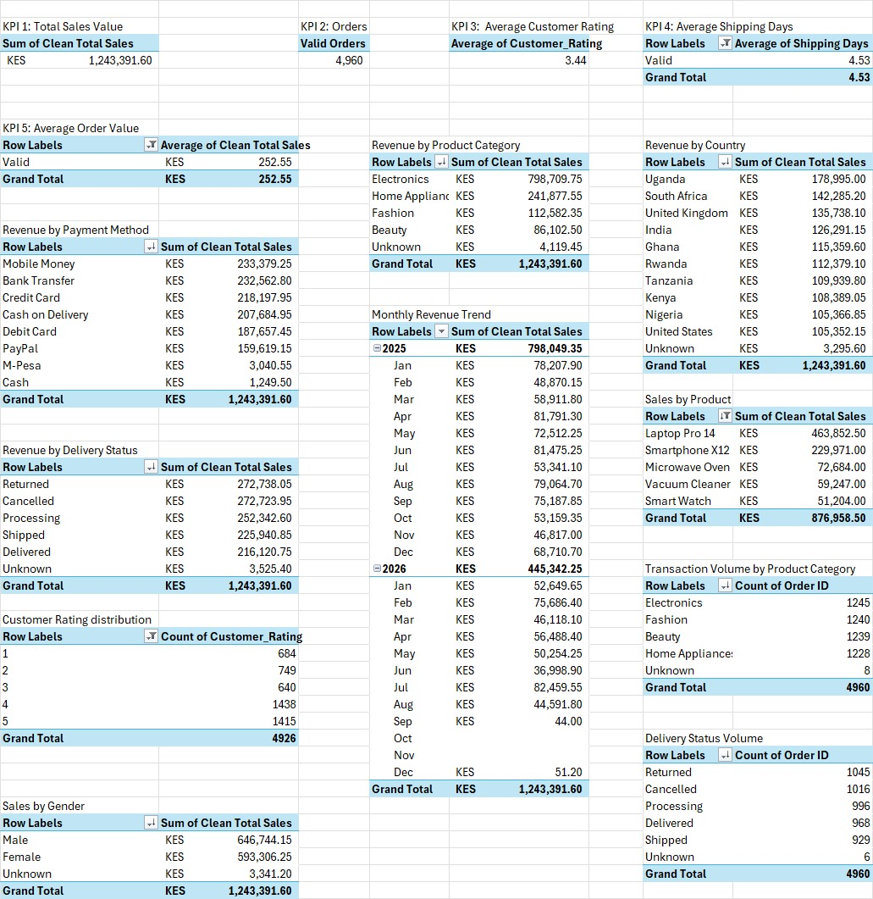
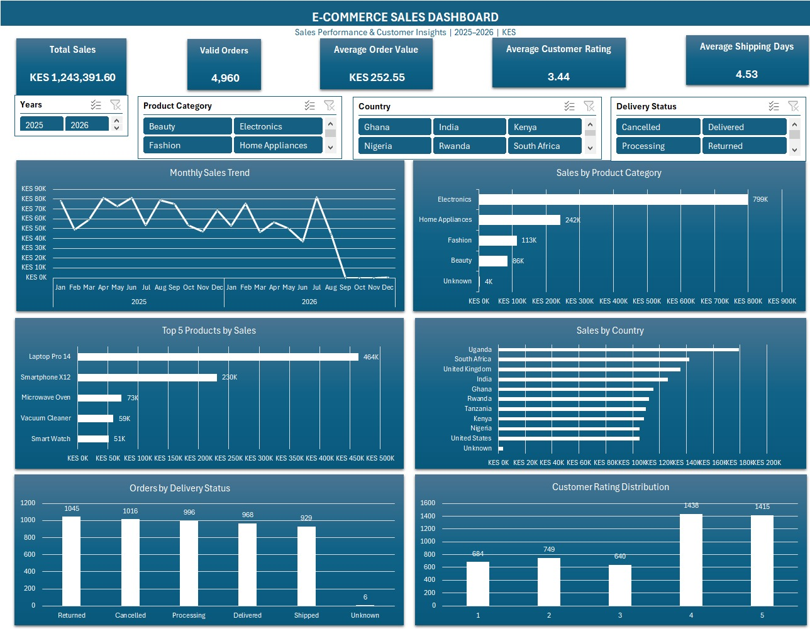

# E-Commerce Sales Analysis

## Project Overview

This project analyzes **5,000 e-commerce transaction records** using **Microsoft Excel and Power Query** to identify sales trends, product performance, geographic performance, and order delivery patterns.

The project follows an end-to-end data analysis workflow, beginning with understanding the raw dataset and defining the business questions before moving into data quality assessment, cleaning, validation, exploratory analysis, KPI development, visualization, and business recommendations.

Rather than simply removing problematic records, I used **Power Query** to clean and standardize the data while creating validation fields to distinguish valid, invalid, missing, outlier, mismatch, and unvalidated values. This approach allowed all **5,000 source records** to be retained while creating reliable analytical fields for the final analysis.

The final output is an **interactive Excel dashboard** that summarizes the most important business metrics and allows users to filter the analysis by **Year, Product Category, Country, and Delivery Status**.

### Project Workflow

`Raw Data → Data Understanding → Business Questions → Data Quality Assessment → Data Cleaning & Transformation → Data Validation → Exploratory Data Analysis → KPI Development → Visualization → Findings → Recommendations → Interactive Dashboard`

### Tools Used

- **Microsoft Excel** :analysis, PivotTables, KPI calculations, charts, and dashboard development
- **Power Query** :data profiling, cleaning, transformation, standardization, and validation
- **PivotTables** :aggregation and exploratory analysis
- **Excel Charts** :data visualization
- **Slicers** :dashboard interactivity
- **Git & GitHub** :project documentation and version control


## Business Questions

Before cleaning and analyzing the dataset, I first reviewed the available fields and defined the business questions that would guide the project.

The analysis focused on five questions:

1. **How has sales performance changed over time?**
2. **Which product categories generate the highest sales?**
3. **Which products are the top performers by sales?**
4. **Which countries generate the highest sales?**
5. **What is the distribution of orders by delivery status?**

Defining the questions before data cleaning helped determine which fields required particular attention during data preparation and validation.

For example, `Order Date` and `Clean Total Sales` were required for trend analysis, while `Product Category`, `Product Name`, `Country`, `Order ID`, and `Delivery Status` were critical for answering the remaining questions.

> 📄 **Detailed documentation:** See [`business_questions.md`](2-business-questions/business_questions.md) for the complete business-question framework.


## Dataset Overview

The project started with a raw e-commerce dataset containing **5,000 transaction records** covering the period **2025–2026**.

The dataset contained information relating to customers, products, transactions, payments, order dates, shipping, delivery outcomes, and customer ratings.

### Key Fields

Some of the main fields used in the analysis included:

- `Order ID`
- `Customer Name`
- `Customer Email`
- `Gender`
- `Age`
- `Country`
- `City`
- `Product Category`
- `Product Name`
- `Quantity`
- `Unit Price`
- `Discount`
- `Total Sales`
- `Payment Method`
- `Order Date`
- `Shipping Date`
- `Delivery Status`
- `Customer Rating`

The raw dataset intentionally contained multiple data-quality problems, making it suitable for practicing an end-to-end data-cleaning and analysis workflow.

### Raw Dataset Preview



> 📂 **Raw data:** The original dataset is available in the [`1-raw-data`](1-raw-data/) folder.


## Data Quality Assessment

Before applying transformations, I profiled the raw dataset in **Power Query** to understand its structure and identify data-quality issues.

I reviewed column quality, data types, errors, missing values, distinct values, value distributions, formatting inconsistencies, and potential outliers.

### Key Issues Identified

The assessment identified several data-quality problems, including:

- Missing Order IDs and customer information
- Invalid customer email formats
- Inconsistent capitalization in Gender, Country, and Product Category
- Missing product categories and product names
- Impossible Age values such as negative values, zero, and extreme ages
- Quantity values stored as mixed text and numbers
- Negative, zero, and unusually large Quantity values
- Currency text and inconsistent formatting in Unit Price
- Multiple date formats in Order Date and Shipping Date
- Recorded Total Sales values that did not always match expected calculations
- Invalid and missing Customer Ratings
- Missing geographic information
- Potential shipping-duration outliers

Rather than immediately deleting records containing these issues, I first identified which fields could be standardized, corrected, validated, or retained with an appropriate status.

### Data Profiling



This profiling stage helped determine the transformations and validation rules required before analysis.


## Data Cleaning & Transformation

Data cleaning and transformation were performed using **Excel Power Query**.

The cleaning process was guided by the business questions so that fields required for the final analysis received particular attention.

Key transformations included:

- Standardizing text capitalization and formatting
- Trimming and cleaning text values
- Handling missing categorical values using `Unknown` where appropriate
- Cleaning customer-name formatting
- Validating customer email addresses
- Standardizing Gender values
- Validating Age against an acceptable analytical range
- Standardizing Country and Product Category values
- Converting Quantity from mixed text/numeric formats into usable numeric values
- Cleaning Unit Price values
- Standardizing Discount Rates
- Standardizing Order Date and Shipping Date
- Validating recorded Total Sales
- Creating a separate `Clean Total Sales` field for analysis
- Calculating Shipping Days
- Standardizing Delivery Status
- Validating Customer Ratings
- Assigning appropriate data types for analysis

### Power Query Transformation Process



The original dataset contained **5,000 records**, and all 5,000 source records were retained through the cleaning and validation process.

> 📄 **Detailed cleaning process:** [`power_query_steps.md`](3-data-cleaning/power_query_steps.md)

> 🧾 **Cleaning log:** [Cleaning Log](3-data-cleaning/Cleaning_log.xlsx)

> 💻 **Power Query M code:** [`m_code.txt`](3-data-cleaning/m_code.txt)


## Data Validation

Rather than automatically deleting every questionable record, I created validation fields to classify data according to its analytical quality.

Depending on the field, records were classified using statuses such as:

- `Valid`
- `Invalid`
- `Missing`
- `Outlier`
- `Mismatch`
- `Not Validated`

This approach preserved the original records while allowing reliable analytical fields to be separated from questionable values.

### Examples of Validation Results

| Validation Area | Result |
|---|---:|
| Valid Order IDs | 4,960 |
| Valid Customer Emails | 4,909 |
| Invalid Customer Emails | 88 |
| Valid Ages | 4,899 |
| Invalid Ages | 98 |
| Valid Quantities | 4,921 |
| Quantity Outliers | 31 |
| Valid Customer Ratings | 4,926 |
| Invalid Customer Ratings | 47 |
| Clean Total Sales Values | 4,921 |

A dedicated cleaning log was maintained to document the identified issue, cleaning action, validation approach, and final result.

### Cleaning Documentation



> 📊 **View the complete cleaning log:** [Cleaning Log](3-data-cleaning/Cleaning_log.xlsx)


## Exploratory Data Analysis

After cleaning and validating the dataset, I used **Excel PivotTables** to explore the data and identify patterns relevant to the business questions.

The exploratory analysis covered:

- Monthly sales performance
- Sales by product category
- Sales by individual product
- Sales by country
- Transaction volume by product category
- Orders by delivery status
- Sales by payment method
- Sales by gender
- Customer rating distribution
- Shipping performance

This stage helped move the project from data preparation into business analysis and also provided the calculations used to build the final dashboard.

### Analysis Workspace



> 📊 **Supporting analysis:** [`analysis_summary.xlsx`](4-analysis/analysis_summary.xlsx)


## Key Performance Indicators

Five headline KPIs were selected to provide a high-level view of sales, orders, customer experience, and shipping performance.

| KPI | Result |
|---|---:|
| **Total Sales Value** | **KES 1,243,391.60** |
| **Valid Orders** | **4,960** |
| **Average Order Value** | **KES 252.55** |
| **Average Customer Rating** | **3.44 / 5** |
| **Average Shipping Time** | **4.53 Days** |

These KPIs provide an executive-level summary, while the supporting analysis explains the patterns behind the headline figures.


## Business Analysis & Findings

### 1. How Has Sales Performance Changed Over Time?

Total Clean Sales amounted to **KES 1,243,391.60** across the analyzed period.

- **2025:** KES 798,049.35
- **2026:** KES 445,342.25
- **Highest month:** July 2026: KES 82,459.55

Monthly sales fluctuated considerably rather than following a consistent upward or downward trend.

The extremely low or missing sales values after August 2026 suggest incomplete transaction coverage. Therefore, the difference between the 2025 and 2026 totals should **not automatically be interpreted as a year-over-year decline**.

**Business implication:** Data completeness should be confirmed before making full-year performance comparisons.

---

### 2. Which Product Categories Generate the Highest Sales?

**Electronics** was the dominant category.

| Product Category | Sales |
|---|---:|
| Electronics | KES 798,709.75 |
| Home Appliances | KES 241,877.55 |
| Fashion | KES 112,582.35 |
| Beauty | KES 86,102.50 |
| Unknown | KES 4,119.45 |

Electronics contributed approximately **64.2% of total sales**.

Interestingly, transaction volumes across the four main categories were relatively similar. This suggests that Electronics' dominance was driven more by **transaction/product value** than simply having substantially more transactions.

**Business implication:** Electronics is a major sales driver but also represents product-category concentration risk.

---

### 3. Which Products Are the Top Performers by Sales?

The Top 5 products generated **KES 876,958.50**, approximately **70.5% of total sales**.

| Product | Sales |
|---|---:|
| Laptop Pro 14 | KES 463,852.50 |
| Smartphone X12 | KES 229,971.00 |
| Microwave Oven | KES 72,684.00 |
| Vacuum Cleaner | KES 59,247.00 |
| Smart Watch | KES 51,204.00 |

**Laptop Pro 14** alone generated approximately **37.3% of total sales**.

Laptop Pro 14 and Smartphone X12 combined generated approximately **55.8% of total sales**.

This also helps explain the strong performance of Electronics.

**Business implication:** Overall sales are highly dependent on a relatively small number of high-value products.

---

### 4. Which Countries Generate the Highest Sales?

**Uganda** generated the highest sales at **KES 178,995.00**, representing approximately **14.4% of total sales**.

It was followed by:

- South Africa — KES 142,285.20
- United Kingdom — KES 135,738.10
- India — KES 126,291.15

Unlike product performance, geographic sales were more evenly distributed.

The top three countries generated approximately **36.7% of total sales**, indicating considerably less geographic concentration than product concentration.

**Business implication:** The business has a relatively diversified geographic sales base, while Uganda provides an opportunity for further investigation into what drives its stronger performance.

---

### 5. What Is the Distribution of Orders by Delivery Status?

The **4,960 valid orders** were distributed as follows:

| Delivery Status | Orders | Share |
|---|---:|---:|
| Returned | 1,045 | 21.1% |
| Cancelled | 1,016 | 20.5% |
| Processing | 996 | 20.1% |
| Delivered | 968 | 19.5% |
| Shipped | 929 | 18.7% |
| Unknown | 6 | 0.1% |

Returned and Cancelled orders combined accounted for approximately **41.6% of valid orders**.

This identifies a potentially important operational issue, although the dataset does not contain sufficient information to determine why the orders were returned or cancelled.

**Business implication:** Return and cancellation drivers require deeper root-cause analysis.

> 📄 **Detailed findings, interpretations, and recommendations:** [`business_findings.md`](4-analysis/business_findings.md)


## Visualization Choices

The dashboard visualizations were selected according to the type of business question being answered.

| Business Question | Visualization | Reason |
|---|---|---|
| Sales performance over time | **Line Chart** | Shows changes, peaks, declines, and patterns across chronological periods |
| Sales by Product Category | **Horizontal Bar Chart** | Supports clear comparison between categorical sales values |
| Top 5 Products by Sales | **Horizontal Bar Chart** | Clearly communicates product ranking and differences in sales value |
| Sales by Country | **Horizontal Bar Chart** | Makes geographic ranking easy to compare while accommodating longer country names |
| Orders by Delivery Status | **Column Chart** | Compares order volumes across a small number of discrete status categories |
| Customer Rating Distribution | **Column Chart** | Shows the frequency distribution across the 1–5 rating scale |

The objective was to use each visual to answer a specific analytical question rather than selecting charts purely for appearance.


## Key Insights

### 1. Sales Are Highly Concentrated by Product

Electronics generated approximately **64.2% of total sales**, while the Top 5 individual products generated approximately **70.5%**.

Laptop Pro 14 and Smartphone X12 alone contributed approximately **55.8% of total sales**.

### 2. Geographic Sales Are More Diversified

While Uganda was the leading market, it contributed only approximately **14.4% of total sales**.

This indicates that geographic sales are considerably more diversified than product sales.

### 3. Transaction Volume Does Not Fully Explain Electronics' Performance

Transaction volumes across the four main product categories were relatively similar, yet Electronics generated substantially greater sales value.

This indicates that product value and product mix are important drivers of the category's performance.

### 4. Returns and Cancellations Require Attention

Returned and Cancelled orders represented approximately **41.6% of valid orders**.

The dataset cannot explain the causes, but the result identifies an important area for further operational investigation.

### 5. Incomplete Periods Can Distort Trend Analysis

The very low or missing sales values toward the end of 2026 demonstrate why data completeness must be assessed before interpreting apparent performance declines.


## Recommendations

Based on the analysis, I would recommend the following:

1. **Protect high-performing products** by maintaining adequate inventory availability for leading products, particularly Laptop Pro 14 and Smartphone X12.

2. **Reduce product concentration risk** by identifying opportunities to grow additional products and lower-performing categories.

3. **Investigate Electronics performance** to understand whether pricing, product mix, customer demand, or other factors explain its substantially higher sales value.

4. **Investigate Uganda's performance** and determine whether successful purchasing patterns or product preferences can be replicated in other markets.

5. **Analyze returns and cancellations in greater detail** and introduce standardized Return Reason and Cancellation Reason fields.

6. **Strengthen data completeness monitoring**, particularly for time-series reporting, so incomplete periods are identified before performance comparisons are made.


## Limitations

The analysis is subject to several limitations:

- The late-2026 transaction data appears incomplete, limiting direct year-over-year comparison.
- The dataset does not contain return or cancellation reasons.
- Promotional activity is not available, limiting explanation of monthly sales peaks.
- Inventory availability and stock-out information are not included.
- Product cost and profit data are unavailable, so the analysis focuses on sales rather than profitability.
- Some customer, product, and geographic values were missing or invalid and required validation or classification as `Unknown`.
- The analysis identifies relationships and patterns but does not establish causation.

These limitations should be considered when interpreting the findings and recommendations.


## Interactive Dashboard

The final stage of the project was the development of an **interactive Excel dashboard** that brings the key metrics and analytical findings together in one view.

The dashboard contains five headline KPIs:

- **Total Sales Value:** KES 1,243,391.60
- **Valid Orders:** 4,960
- **Average Order Value:** KES 252.55
- **Average Customer Rating:** 3.44 / 5
- **Average Shipping Time:** 4.53 Days

### Dashboard Filters

Four interactive slicers allow users to explore performance by:

- **Year**
- **Product Category**
- **Country**
- **Delivery Status**

The slicers are connected to the relevant PivotTables and charts, allowing the dashboard to update dynamically as different selections are made.

### Dashboard Preview



### Dashboard Demo

A short video demonstration is available showing how the dashboard responds to different filter selections.

▶️ **[Watch the Interactive Dashboard Demo](5-dashboard/ecommerce_dashboard_demo.mp4)**

📊 **[View Dashboard Files](5-dashboard/)**


## Repository Structure

```text
E-Commerce-Sales-Analysis/
│
├── 1-raw-data/
│   └── [Raw e-commerce dataset]
│
├── 2-business-questions/
│   └── business_questions.md
│
├── 3-data-cleaning/
│   ├── Cleaning_log.xlsx
│   ├── power_query_steps.md
│   └── m_code.txt
│
├── 4-analysis/
│   ├── analysis_summary.xlsx
│   └── business_findings.md
│
├── 5-dashboard/
│   ├── ecommerce_dashboard.jpeg
│   └── ecommerce_dashboard_demo.mp4
│
├── 6-images/
│   ├── 01-raw-data.jpeg
│   ├── 02-data-quality.jpeg
│   ├── 03-power-query.jpeg
│   ├── 04-cleaning-log.jpeg
│   ├── 05-analysis.jpeg
│   └── 06-dashboard.jpeg
│
├── Full Project Workbook/
│   └── E-Commerce_Sales_Analysis.xlsxb
│
└── README.md
```

Each folder represents a stage of the analytical workflow, allowing the project to be reviewed from the original raw data through cleaning, analysis, findings, and final dashboard.


## Full Project Workbook

The complete Excel workbook contains the cleaned dataset, analytical calculations, PivotTables, and interactive dashboard used throughout the project.

📥 **[Download the Full Project Workbook](Full%20Project%20Workbook/E-Commerce_Sales_Analysis.xlsb)**

The supporting folders in this repository provide additional documentation for the individual stages of the project.


## Tools & Skills Demonstrated

### Microsoft Excel

- PivotTables
- PivotCharts
- Excel formulas
- KPI development
- Slicers
- Interactive dashboard design
- Data visualization
- Business analysis

### Power Query

- Data profiling
- Data cleaning
- Data-type conversion
- Text standardization
- Missing-value handling
- Conditional logic
- Data validation
- Custom columns
- Date transformation
- Error handling
- M code

### Data Analysis

- Business-question development
- Data-quality assessment
- Exploratory data analysis
- Trend analysis
- Product-performance analysis
- Geographic analysis
- Order-status analysis
- KPI interpretation
- Business insight development
- Evidence-based recommendations

### Documentation & Version Control

- Markdown documentation
- Analytical documentation
- Cleaning logs
- Git
- GitHub
- GitHub Desktop


## Project Summary

This project demonstrates an end-to-end Excel data analysis workflow, from defining business questions and assessing raw-data quality through Power Query cleaning, validation, exploratory analysis, visualization, and business recommendations.

The project also demonstrates the importance of looking beyond dashboard values. Data completeness, validation results, analytical limitations, and the business context behind each metric were considered before drawing conclusions.

The final result is an interactive Excel dashboard supported by documented cleaning steps, analytical evidence, findings, recommendations, and reproducible Power Query transformations.

---

**Project:** E-Commerce Sales Analysis  
**Tools:** Microsoft Excel | Power Query | PivotTables | Excel Charts | GitHub
